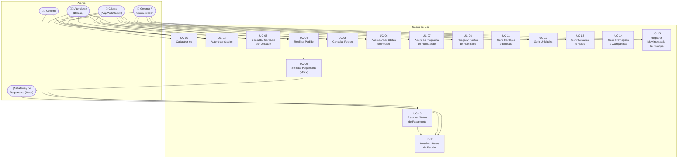
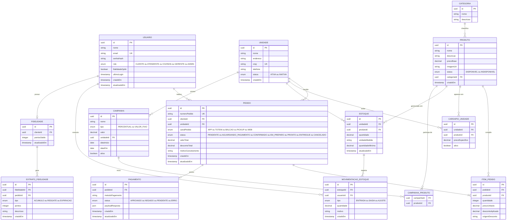
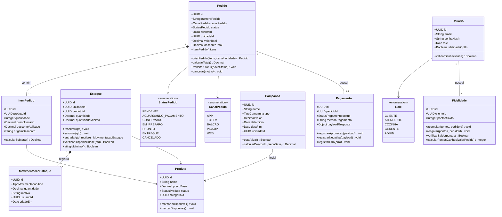
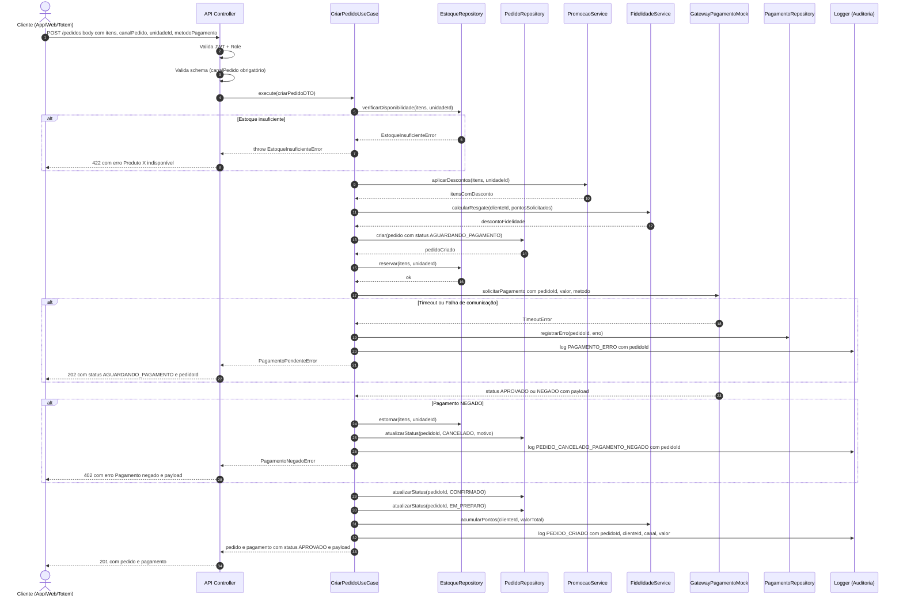

# Raiz do Nordeste — Requisitos e Casos de Uso

> **Projeto:** raizdonordeste-api-backend  
> **Stack:** Node.js · TypeScript · Testes Unitários (Jest)  
> **Última atualização:** 2026-08-06

---

## Sumário

1. [Requisitos Funcionais (RF)](#1-requisitos-funcionais-rf)
2. [Requisitos Não Funcionais (RNF)](#2-requisitos-não-funcionais-rnf)
3. [Diagrama de Casos de Uso](#3-diagrama-de-casos-de-uso)
4. [Descrição de Features Críticas](#4-descrição-de-features-críticas)
5. [DER — Modelo de Dados](#5-der--modelo-de-dados)
6. [Arquitetura em Camadas](#6-arquitetura-em-camadas)
7. [Diagrama de Classes (Domínio)](#7-diagrama-de-classes-domínio)
8. [Diagrama de Sequência — Fluxo Crítico](#8-diagrama-de-sequência--fluxo-crítico)

---

## 1. Requisitos Funcionais (RF)

### RF-01 — Cadastro e Autenticação de Usuários

| ID | Descrição |
|----|-----------|
| RF-01.1 | O sistema deve permitir o cadastro de usuários com os campos: nome, e-mail, senha (armazenada com hash bcrypt) e perfil (role). |
| RF-01.2 | Os perfis (roles) suportados são: `CLIENTE`, `ATENDENTE`, `COZINHA`, `GERENTE`, `ADMIN`. |
| RF-01.3 | O sistema deve autenticar usuários via e-mail e senha, retornando um token JWT com tempo de expiração configurável. |
| RF-01.4 | O sistema deve suportar renovação de token (refresh token) sem reautenticação completa. |
| RF-01.5 | Apenas usuários com role `GERENTE` ou `ADMIN` podem cadastrar novos atendentes, cozinheiros ou gerentes. |
| RF-01.6 | O sistema deve registrar data/hora do último login de cada usuário (auditoria). |

---

### RF-02 — Gestão de Unidades da Rede

| ID | Descrição |
|----|-----------|
| RF-02.1 | O sistema deve permitir o cadastro de unidades (restaurantes/franquias) com: nome, endereço, CNPJ, telefone e status (ATIVA / INATIVA). |
| RF-02.2 | Cada unidade possui seu próprio cardápio e estoque independentes. |
| RF-02.3 | Somente usuários com role `ADMIN` podem criar, editar ou inativar unidades. |
| RF-02.4 | A API deve permitir listar todas as unidades ativas com suporte a paginação. |

---

### RF-03 — Cardápio por Unidade

| ID | Descrição |
|----|-----------|
| RF-03.1 | Cada unidade possui um cardápio próprio, composto por produtos organizados em categorias. |
| RF-03.2 | Um produto contém: nome, descrição, preço base, categoria, imagem (URL) e status (DISPONIVEL / INDISPONIVEL). |
| RF-03.3 | O sistema deve impedir a exibição de produtos sem estoque no cardápio (status automático por indisponibilidade). |
| RF-03.4 | A API deve permitir consultar o cardápio de uma unidade específica, filtrando por categoria ou disponibilidade. |
| RF-03.5 | Gerentes podem adicionar, editar e remover itens do cardápio de sua unidade. |
| RF-03.6 | O sistema deve suportar promoções/campanhas aplicadas a produtos ou categorias (desconto percentual ou valor fixo, com vigência por data). |

---

### RF-04 — Gestão de Pedidos

| ID | Descrição |
|----|-----------|
| RF-04.1 | O sistema deve permitir a criação de pedidos com: itens (produto + quantidade + preço unitário), unidade destino, canal de origem e cliente associado (opcional para pedidos anônimos no totem). |
| RF-04.2 | **O campo `canalPedido` é obrigatório** na criação do pedido. Os valores permitidos são: `APP`, `TOTEM`, `BALCAO`, `PICKUP`, `WEB`. |
| RF-04.3 | A API deve permitir consultar/filtrar pedidos por canal via query param (`?canalPedido=TOTEM`). |
| RF-04.4 | O sistema deve validar disponibilidade de estoque de cada item antes de confirmar o pedido. |
| RF-04.5 | O pedido possui um fluxo de status: `PENDENTE` → `AGUARDANDO_PAGAMENTO` → `CONFIRMADO` → `EM_PREPARO` → `PRONTO` → `ENTREGUE` \| `CANCELADO`. |
| RF-04.6 | A transição de status deve respeitar a máquina de estados definida; transições inválidas devem retornar erro. |
| RF-04.7 | Somente usuários com role `COZINHA` podem transitar um pedido de `EM_PREPARO` para `PRONTO`. |
| RF-04.8 | Somente usuários com role `ATENDENTE` ou `GERENTE` podem marcar um pedido como `ENTREGUE` ou `CANCELADO`. |
| RF-04.9 | O cliente pode cancelar seu próprio pedido enquanto o status for `PENDENTE` ou `AGUARDANDO_PAGAMENTO`. |
| RF-04.10 | Cada pedido deve ter um identificador único (UUID) e um número sequencial amigável por unidade (ex.: `#0042`). |
| RF-04.11 | O cancelamento de pedido deve estornar automaticamente os itens de volta ao estoque. |

---

### RF-05 — Controle de Estoque

| ID | Descrição |
|----|-----------|
| RF-05.1 | Cada produto/ingrediente possui um registro de estoque por unidade, com quantidade disponível e unidade de medida. |
| RF-05.2 | O sistema deve registrar movimentações de estoque (entrada / saída / ajuste) com motivo, responsável e timestamp. |
| RF-05.3 | A saída de estoque ocorre automaticamente ao confirmar o pedido. |
| RF-05.4 | A entrada de estoque pode ser registrada manualmente por `GERENTE` ou `ADMIN`. |
| RF-05.5 | O sistema deve alertar (via log/evento) quando a quantidade de um item atingir o estoque mínimo configurado. |
| RF-05.6 | Produtos sem estoque suficiente devem ser automaticamente marcados como `INDISPONIVEL` no cardápio. |

---

### RF-06 — Programa de Fidelização

| ID | Descrição |
|----|-----------|
| RF-06.1 | O programa de fidelização é opt-in: o cliente deve consentir explicitamente (conformidade LGPD). |
| RF-06.2 | A cada pedido confirmado e pago, o cliente acumula pontos proporcionais ao valor total do pedido (regra configurável, ex.: R$ 1,00 = 1 ponto). |
| RF-06.3 | O cliente pode resgatar pontos para obter desconto em pedidos futuros (ex.: 100 pontos = R$ 5,00 de desconto). |
| RF-06.4 | O sistema deve registrar o extrato de pontos do cliente: acúmulo, resgate e saldo atual. |
| RF-06.5 | Pontos expiram após período configurável (ex.: 12 meses sem movimentação). |
| RF-06.6 | Somente clientes com saldo suficiente de pontos podem realizar resgate; tentativas inválidas devem retornar erro de negócio. |

---

### RF-07 — Promoções e Campanhas

| ID | Descrição |
|----|-----------|
| RF-07.1 | O sistema deve suportar o cadastro de campanhas promocionais com: nome, tipo (desconto percentual ou valor fixo), produtos/categorias elegíveis, unidades participantes e período de vigência (data início e fim). |
| RF-07.2 | Ao criar/calcular um pedido, a camada de aplicação deve consultar campanhas ativas e aplicar automaticamente o desconto ao item elegível. |
| RF-07.3 | Somente um desconto pode ser aplicado por item (regra de precedência: a maior vantagem ao cliente prevalece). |
| RF-07.4 | O pedido deve registrar os descontos aplicados e suas origens (campo `descontoAplicado`). |
| RF-07.5 | `GERENTE` pode criar campanhas para sua unidade; `ADMIN` pode criar campanhas para toda a rede. |

---

### RF-08 — Integração com Gateway de Pagamento (Mock)

| ID | Descrição |
|----|-----------|
| RF-08.1 | Ao confirmar um pedido, o sistema deve solicitar o pagamento ao serviço externo mock, enviando: valor total, identificador do pedido e método de pagamento. |
| RF-08.2 | O mock deve retornar: status (`APROVADO`, `NEGADO`, `PENDENTE`) e payload de resposta. |
| RF-08.3 | O sistema deve registrar a transação de pagamento com: pedido associado, status, payload completo recebido e timestamp. |
| RF-08.4 | Em caso de falha de comunicação com o mock (timeout, 5xx), o sistema deve registrar o erro, manter o pedido em `AGUARDANDO_PAGAMENTO` e possibilitar nova tentativa (idempotência garantida pela chave de pedido). |
| RF-08.5 | Pagamentos negados devem transitar o pedido para `CANCELADO`, com motivo registrado. |
| RF-08.6 | O resultado do pagamento (status + payload) deve ser retornado ao canal de origem (App / Totem / Web) na resposta da API. |

---

## 2. Requisitos Não Funcionais (RNF)

### RNF-01 — Segurança

| ID | Descrição |
|----|-----------|
| RNF-01.1 | Senhas de usuários devem ser armazenadas exclusivamente com hash bcrypt (fator de custo ≥ 10). Nenhuma senha em texto plano deve trafegar ou ser persistida. |
| RNF-01.2 | Toda requisição autenticada deve ser validada via JWT (Bearer Token). Tokens expirados ou inválidos devem retornar HTTP 401. |
| RNF-01.3 | Controle de acesso baseado em roles (RBAC): cada endpoint deve declarar explicitamente quais roles possuem acesso. |
| RNF-01.4 | Dados pessoais de clientes (e-mail, CPF, telefone) devem ser tratados conforme a LGPD: coletados somente com consentimento, não expostos em logs e com suporte a solicitação de exclusão. |
| RNF-01.5 | A API deve implementar rate limiting para prevenir ataques de força bruta nos endpoints de autenticação. |
| RNF-01.6 | Comunicações com o gateway de pagamento mock devem utilizar HTTPS (mesmo em ambiente de desenvolvimento). |

---

### RNF-02 — Logs e Auditoria

| ID | Descrição |
|----|-----------|
| RNF-02.1 | Ações sensíveis devem gerar logs estruturados (JSON) com: usuário, ação, entidade afetada, timestamp e IP de origem. Ações sensíveis incluem: login, criação/cancelamento de pedido, alteração de estoque, resgate de pontos e criação de usuário. |
| RNF-02.2 | Logs de erro devem incluir stack trace e contexto da requisição, sem expor dados pessoais. |
| RNF-02.3 | Logs devem ser gravados em saída padrão (stdout/stderr) em formato compatível com agregadores (ex.: ELK, CloudWatch). |
| RNF-02.4 | O sistema deve manter trilha de auditoria imutável para transações financeiras (pagamento) e movimentações de estoque. |

---

### RNF-03 — Desempenho

| ID | Descrição |
|----|-----------|
| RNF-03.1 | A API de consulta de cardápio deve responder em menos de 200ms (p95) em condições normais, com uso de cache (Redis ou in-memory) para cardápios ativos. |
| RNF-03.2 | A API de criação de pedido deve suportar ao menos 100 requisições simultâneas sem degradação crítica. |
| RNF-03.3 | Operações de leitura intensas (listagem de pedidos, cardápio) devem utilizar paginação para evitar sobrecarga de banco. |

---

### RNF-04 — Disponibilidade e Tolerância a Falhas

| ID | Descrição |
|----|-----------|
| RNF-04.1 | O sistema deve manter disponibilidade de 99,5% em horários de pico (ex.: horário de almoço e jantar). |
| RNF-04.2 | A falha no gateway de pagamento não deve derrubar o sistema; o pedido deve permanecer em estado intermediário (`AGUARDANDO_PAGAMENTO`) para nova tentativa. |
| RNF-04.3 | O sistema deve implementar timeout configurável na chamada ao mock de pagamento (padrão: 5 segundos). |
| RNF-04.4 | Migrations de banco de dados devem ser reversíveis (rollback seguro). |

---

### RNF-05 — Documentação

| ID | Descrição |
|----|-----------|
| RNF-05.1 | Todos os endpoints devem ser documentados via OpenAPI 3.0 / Swagger, incluindo schemas de request/response, códigos HTTP e exemplos. |
| RNF-05.2 | A documentação Swagger deve estar disponível no endpoint `/api/docs` em ambiente de desenvolvimento. |
| RNF-05.3 | O repositório deve conter README com instruções de setup, variáveis de ambiente necessárias e exemplos de requisição. |

---

### RNF-06 — Qualidade de Código e Testes

| ID | Descrição |
|----|-----------|
| RNF-06.1 | O projeto utiliza **Node.js com TypeScript** (strict mode habilitado). |
| RNF-06.2 | Testes unitários com **Jest**: cada caso de uso deve ter ao menos um teste cobrindo o caminho principal e um cobrindo o caminho de erro. |
| RNF-06.3 | Fakes/stubs devem ser preferidos a mocks de implementação para testar portas do domínio. |
| RNF-06.4 | Cobertura de código mínima: 80% nas camadas de domínio e aplicação. |
| RNF-06.5 | Pirâmide de testes: muitos testes unitários (domínio/use case, sem rede/DB) → alguns de integração → poucos E2E. |

---

## 3. Diagrama de Casos de Uso



---

## 4. Descrição de Features Críticas

### UC-04 + UC-09 — Realizar Pedido + Solicitar Pagamento

#### Atores
- **Primário:** Cliente (App / Web / Totem) ou Atendente (Balcão)
- **Secundário:** Gateway de Pagamento (Mock)

#### Pré-condições
1. O usuário está autenticado (token JWT válido) **ou** o pedido é anônimo via Totem.
2. A unidade destino está com status `ATIVA`.
3. Todos os produtos do pedido estão disponíveis no cardápio e com estoque suficiente.
4. O campo `canalPedido` foi informado (obrigatório).

#### Fluxo Principal

```
1. Cliente seleciona itens e confirma o pedido (com canalPedido e unidadeId).
2. Sistema valida o token JWT (se autenticado).
3. Sistema valida disponibilidade de estoque para cada item.
4. Sistema aplica promoções/descontos ativos.
5. Sistema aplica desconto de fidelidade (se solicitado e com saldo).
6. Sistema cria o pedido com status PENDENTE e gera UUID + número sequencial.
7. Sistema baixa o estoque dos itens.
8. Sistema solicita pagamento ao mock: { pedidoId, valor, metodoPagamento }.
9. Mock retorna: { status: "APROVADO", payload: {...} }.
10. Sistema registra a transação de pagamento.
11. Sistema transita o pedido para CONFIRMADO → EM_PREPARO.
12. Sistema acumula pontos de fidelidade (se cliente opt-in).
13. Sistema retorna ao canal de origem: { pedido, pagamento: { status, payload } }.
```

#### Pós-condições
- Pedido registrado com status `EM_PREPARO`.
- Estoque deduzido corretamente.
- Transação de pagamento persistida com payload do mock.
- Pontos de fidelidade acumulados (se aplicável).
- Log de auditoria registrado.

#### Fluxos Alternativos / Exceções

| Situação | Comportamento |
|----------|---------------|
| **Estoque insuficiente** | Sistema retorna `HTTP 422` com detalhe do item indisponível. Pedido **não** é criado. Estoque **não** é alterado. |
| **Pagamento negado pelo mock** | Sistema registra a transação com status `NEGADO`. Pedido transita para `CANCELADO`. Estoque é estornado. Resposta ao cliente inclui motivo da negativa. |
| **Timeout / falha de comunicação com o mock** | Sistema registra o erro. Pedido permanece em `AGUARDANDO_PAGAMENTO`. Cliente recebe `HTTP 202` com instrução de verificar status. Nova tentativa de pagamento pode ser feita (idempotência garantida pelo `pedidoId`). |
| **`canalPedido` não informado** | Sistema retorna `HTTP 400 Bad Request` com mensagem de validação. |
| **Token JWT expirado** | Sistema retorna `HTTP 401 Unauthorized`. |
| **Pedido duplicado (idempotência)** | Sistema detecta pedido com mesmo `pedidoId` e retorna o pedido existente sem reprocessar. |

#### Regras de Negócio
- Um pedido **nunca** é criado sem que o estoque seja reservado atomicamente.
- A solicitação de pagamento ao mock é idempotente: a mesma chave de `pedidoId` não gera cobranças duplicadas.
- A máquina de estados do pedido é a única fonte de verdade para transições válidas.

---

## 5. DER — Modelo de Dados



---

## 6. Arquitetura em Camadas

A solução adota **Clean Architecture** com separação explícita em quatro camadas. A regra de dependência flui sempre de fora para dentro: nenhuma camada interna conhece detalhes de camadas externas.

```
src/
├── domain/                  # Camada de Domínio
│   ├── entities/            # Entidades e objetos de valor (Pedido, Produto, Estoque...)
│   ├── enums/               # Enums de domínio (StatusPedido, CanalPedido, Role...)
│   ├── errors/              # Erros de negócio tipados (EstoqueInsuficienteError, etc.)
│   ├── events/              # Eventos de domínio (PedidoCriadoEvent, PagamentoAprovadoEvent...)
│   └── repositories/        # Interfaces (ports) dos repositórios
│
├── application/             # Camada de Aplicação
│   ├── use-cases/           # Orquestradores de fluxo (CriarPedidoUseCase, etc.)
│   ├── services/            # Serviços de aplicação (FidelidadeService, PromocaoService...)
│   └── ports/               # Interfaces de saída (IGatewayPagamento, IEmailService...)
│
├── infrastructure/          # Camada de Infraestrutura
│   ├── database/
│   │   ├── migrations/      # Migrations versionadas
│   │   ├── repositories/    # Implementações dos repositórios (TypeORM/Prisma)
│   │   └── models/          # Modelos ORM
│   ├── gateways/
│   │   └── pagamento-mock/  # Implementação do cliente HTTP para o mock de pagamento
│   ├── logger/              # Implementação do logger estruturado (Winston/Pino)
│   └── cache/               # Implementação de cache (Redis / in-memory)
│
├── api/                     # Camada de Interface (API)
│   ├── controllers/         # Controllers HTTP (Express / Fastify)
│   ├── middlewares/         # Auth JWT, rate-limit, validação de schema
│   ├── routes/              # Definição de rotas
│   ├── dto/                 # Schemas de request/response (Zod / class-validator)
│   └── docs/                # Configuração OpenAPI / Swagger
│
└── tests/
    ├── unit/                # Testes unitários (domínio e use cases — sem rede/DB)
    ├── integration/         # Testes de integração (requerem banco)
    └── e2e/                 # Testes end-to-end (HTTP completo)
```

### Responsabilidades por Camada

| Camada | O que faz | O que NÃO faz |
|--------|-----------|----------------|
| **Domain** | Define entidades, regras de negócio, validações, máquina de estados do pedido | Conhece Express, banco de dados, HTTP |
| **Application** | Orquestra casos de uso, chama repositórios via interfaces, aplica regras transversais (fidelidade, promoções) | Conhece detalhes de banco ou framework HTTP |
| **Infrastructure** | Implementa interfaces do domínio/aplicação: persistência, chamadas HTTP externas, cache, log | Contém regras de negócio |
| **API** | Recebe requisições HTTP, valida entrada, delega para use cases, formata resposta | Contém lógica de negócio |

---

## 7. Diagrama de Classes (Domínio)



---

## 8. Diagrama de Sequência — Fluxo Crítico

### Pedido → Pagamento Externo → Atualização de Status



---

## Referências de Tecnologia

| Categoria | Ferramenta sugerida |
|-----------|---------------------|
| Runtime | Node.js 20 LTS |
| Linguagem | TypeScript 5 (strict) |
| Framework HTTP | Fastify ou Express |
| ORM / Migrations | Prisma ou TypeORM |
| Banco de dados | PostgreSQL |
| Cache | Redis (ou `node-cache` para ambiente simples) |
| Autenticação | `jsonwebtoken` + `bcrypt` |
| Validação de schema | Zod ou `class-validator` |
| Testes | Jest + `ts-jest` |
| Logger | Pino ou Winston |
| Documentação | `swagger-ui-express` + `@fastify/swagger` |
| Containerização | Docker + Docker Compose |
